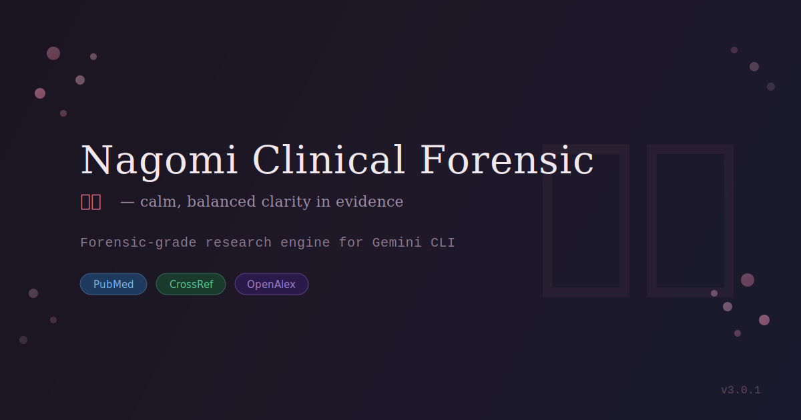

# PubMed Gemini Extension


Nagomi (和み): calm, balanced clarity in evidence.

> **Your AI Research Assistant for 35+ Million Medical Studies**

[](https://github.com/avivlyweb/pubmed-gemini-extension/releases)
[](LICENSE)
[](https://pubmed.ncbi.nlm.nih.gov/)

PubMed Gemini is a Gemini CLI extension that searches PubMed and turns the results into evidence-weighted answers you can use right away.

**TL;DR**
- Ask in plain language, it searches 35M+ PubMed studies
- Get a weighted evidence verdict with trust scores and links
- Export citations to BibTeX, RIS, or EndNote
- **NEW in v3.0:** ABC-TOM intelligent fake citation detection with 6-tier classification

<details>
<summary>Brand assets</summary>

**和み (Nagomi):** A Japanese concept of calm harmony. In research, it means cutting through noise to find what matters.

Social preview image:


</details>

— — —

## Installation

### Method 1: Official Gemini CLI (Recommended)

If you already have Gemini CLI installed:
```bash
gemini extensions install https://github.com/avivlyweb/pubmed-gemini-extension
```

That's it! The extension will be ready to use.

— — —

### Method 2: Quick Install Script

**Mac or Linux:**

**Step 1:** Open Terminal (search "Terminal" in Spotlight)

**Step 2:** Copy and paste this command, then press Enter:
```bash
curl -fsSL https://raw.githubusercontent.com/avivlyweb/pubmed-gemini-extension/main/install.sh | bash
```

**Step 3:** Wait for "Installation complete!" message (about 1-2 minutes)

— — —

**Windows:**

**Step 1:** Open PowerShell as Administrator
- Press Windows key
- Type "PowerShell"
- Right-click → "Run as administrator"

**Step 2:** Copy and paste this command, then press Enter:
```powershell
irm https://raw.githubusercontent.com/avivlyweb/pubmed-gemini-extension/main/install.ps1 | iex
```

**Step 3:** Wait for "Installation complete!" message (about 1-2 minutes)

— — —

## Start Using It

After installation, open a new terminal/command prompt and type:
```
gemini
```

Then ask any medical research question:
```
Does yoga help with anxiety?
```

That's it! Gemini will search PubMed and give you an evidence-based answer.

— — —

## How It Works (Simple)

1. You ask a question in plain language.
2. PubMed Gemini searches PubMed for the best matches.
3. It grades evidence quality and weighs study types.
4. You get a clear verdict, key findings, and links.
5. Export citations if you want to write or share.

— — —

## Quick Questions You Can Ask

- "What is the most effective way to lose weight?"
- "Should I take vitamin A, and why?"
- "Is coffee good for heart health?"
- "Does yoga help anxiety?"

— — —

## Screenshots

<table>
  <tr>
    <td width="50%"></td>
    <td width="50%"></td>
  </tr>
  <tr>
    <td><sub>Nagomi consent: calm first-run permission</sub></td>
    <td><sub>Refined search: quieter, sharper scope</sub></td>
  </tr>
  <tr>
    <td colspan="2"></td>
  </tr>
  <tr>
    <td colspan="2"><sub>Clinical summary: clear, grounded output</sub></td>
  </tr>
</table>

— — —

## What Can You Do?

| You Ask | You Get |
|---------|---------| 
| "Does yoga help anxiety?" | Evidence verdict from 15+ studies with quality weighting |
| "Find COPD exercise studies" | Ranked articles with trust scores & direct PDF links |
| "Export those to BibTeX" | Ready-to-use citations for your paper |
| "Is this treatment effective?" | AI synthesis with clinical bottom line |
| "Verify references in my PDF" | Detection of fake/hallucinated citations |

**One command. PhD-level analysis. Seconds.**

— — —

## New in v3.0 - ABC-TOM Intelligent Reference Verification

### 6-Tier Classification System

The reference verification system now uses intelligent classification to distinguish between genuinely fake citations and valid sources that simply aren't indexed:

| Status | Icon | Meaning |
|--------|------|---------|
| `VERIFIED` | OK | Exact match in PubMed/CrossRef |
| `VERIFIED_LEGACY_DOI` | LEGACY | Paper exists but DOI is broken/migrated |
| `GREY_LITERATURE` | GREY | Valid source not indexed (WHO, guidelines, reports) |
| `LOW_QUALITY_SOURCE` | LOW | Real but not peer-reviewed (preprints, ResearchGate) |
| `SUSPICIOUS` | WARN | Partial match with discrepancies |
| `NOT_FOUND` | MISS | No match in any database |
| `DEFINITE_FAKE` | FAKE | Frankenstein citation or impossible data |

### Grey Literature Detection

Automatically recognizes valid non-indexed sources:
- **Government:** WHO, CDC, NIH, AHRQ, FDA, NHS
- **Guidelines:** NICE, SIGN, Cochrane, PRISMA, CONSORT
- **Standards:** STROBE, MOOSE, STARD, TRIPOD
- **Books & Software:** Textbooks, SPSS, Stata, R citations

### Frankenstein Citation Detection

Catches sophisticated AI hallucinations where real DOIs are attached to fake papers:

```
FAKE [13] DEFINITE_FAKE
  "Hao, J. et al. (2025). Biomechanical analysis..."
  
  Problem:
     FRANKENSTEIN CITATION: DOI resolves to different paper.
     Cited: 'Biomechanical analysis of PAP...'
     DOI actual: 'Quality improvement in healthcare...'
  
  What to do:
     REMOVE or REPLACE this reference immediately.
     This is a 'Frankenstein citation' - real DOI attached to wrong paper.
```

### PDF Layout Issue Detection

When 70%+ of references fail verification:
- Automatically detects PDF column breaks and hyphenation issues
- Distinguishes parsing problems from mass hallucination
- Provides actionable recommendations

### Year Tolerance for Online First

- Accepts +/-1 year difference for recent publications
- Reduces false positives for "Online First" papers
- Papers <18 months old get benefit of doubt

### ABC-TOM Framework

The `/ABC-TOM` folder contains the verification philosophy:
- `A-agents/`: Agent role definitions
- `C-core/`: Core identity and principles  
- `M-memory/`: Learning log with known patterns
- `T-tools/`: Verification protocols

---

## Previous Enhancements (v2.8)

### Multi-Source DOI Verification

DOIs that fail initial checks are now verified against multiple sources:

| Source | Purpose |
|--------|---------|
| **doi.org** | Primary DOI resolution check |
| **CrossRef API** | Direct metadata lookup |
| **OpenAlex** | Free, comprehensive academic database |
| **Europe PMC** | European papers and preprints |

### Frankenstein Detection

Catches "Frankenstein references" - fake citations that combine real DOIs with fabricated metadata:

```
🚨 [13] DEFINITE_FAKE
  "Hao, J. et al. (2025). Biomechanical analysis of PAP..."
  
  📍 Problem:
     • DOI mismatch: Claims "Annals of Biomedical Engineering" 
       but DOI points to "Quality & Safety in Health Care"
     • Title similarity: 12% (threshold: 60%)
  
  ✏️  What to do:
     REMOVE or REPLACE this reference immediately.
     → Search Google Scholar for the correct citation.
```

### Title Similarity Threshold

- Uses `rapidfuzz` for fast, accurate title matching
- References must have ≥60% title similarity to claimed DOI metadata
- Below threshold → flagged as potential Frankenstein

### Actionable Advice

Every flagged reference now includes:

| Field | Purpose |
|-------|---------|
| **Problem** | What's wrong with this reference |
| **What to do** | Specific action to take |
| **Verify here** | Direct links to Google Scholar, CrossRef |

### PDF Table Filtering (v2.8.1)

Improved PDF parsing to filter out table content that was incorrectly extracted as references:

- Detects statistical values (p-values, CIs, ORs)
- Filters percentage and fraction patterns
- Validates minimum reference characteristics (length, author pattern, year)

— — —

## New in v2.7 - Reference Verification (Fake Citation Detector)

### Catch AI-Hallucinated References

With the rise of AI-generated academic papers, fake references are becoming a serious problem. This tool verifies citations against real databases:

```
You: /pubmed:verify path/to/paper.pdf

Gemini: Analyzing 74 references...

VERIFICATION SUMMARY
════════════════════════════════════════
Total References:  74
✅ Verified:       24 (32.4%)
🚨 Definite Fake:   5 (6.8%)
⚠️  Suspicious:     23 (31.1%)
❌ Not Found:      17 (23.0%)
ℹ️  Likely Valid:    5 (6.8%)

FLAGGED REFERENCES:
[3] 🚨 DEFINITE_FAKE - Doe, J. et al. (2025)
    → Future publication date - impossible
    → Verify manually: https://scholar.google.com/scholar?q=...
[7] ❌ NOT_FOUND - Sample, A.B. et al. (2022)
    → DOI does not resolve: 10.0000/fake.example.001

LIKELY VALID (but not in databases):
[15] ℹ️ "Expert Systems with Applications paper..."
    → Not in PubMed but found in CrossRef - non-medical journal

LIMITATIONS
────────────────────────────────────────
• PubMed primarily indexes biomedical literature
• Non-medical journals may show false 'Not Found' results
• 🚨 DEFINITE_FAKE = high confidence fake (future dates, DOI→wrong field)
• ℹ️ LIKELY_VALID = probably real but outside our database coverage
• Always verify flagged references manually before drawing conclusions
```

### Confidence Tiers

| Status | Meaning | Action |
|--------|---------|--------|
| 🚨 **DEFINITE_FAKE** | 100% certain fake (future dates, DOI points to wrong field) | Remove citation |
| ❌ **NOT_FOUND** | Not in any database, no good match | Verify manually |
| ⚠️ **SUSPICIOUS** | Partial match, some discrepancies | Review carefully |
| ℹ️ **LIKELY_VALID** | Not in PubMed but appears legitimate (non-medical journal) | Probably OK |
| ✅ **VERIFIED** | Found in databases, good match | Confirmed real |

### What Gets Checked

| Check | How It Works |
|-------|--------------|
| **PubMed Lookup** | Searches 35M+ articles for author/title matches |
| **DOI Resolution** | Verifies DOI actually resolves (with retry logic) |
| **CrossRef Validation** | Cross-references against CrossRef database |
| **Year Verification** | Flags future dates or year mismatches |
| **Field Detection** | Identifies non-medical journals to reduce false positives |
| **APA Style** | Checks APA 7th Edition formatting |

### Quick Verification

Check a single DOI or PMID instantly:

```
You: /pubmed:verify https://doi.org/10.1038/nature12373

Gemini: ✅ VERIFIED (100% confidence)
  Title: "Nanometre-scale thermometry in a living cell"
  Found in: PubMed, CrossRef
  DOI resolves: Yes
```

### APA 7th Edition Style Check

The tool also validates reference formatting against APA 7th Edition rules:

| Rule | What Gets Checked |
|------|-------------------|
| **Author format** | Last, F. M. (inverted, with initials) |
| **Year format** | (2023). (in parentheses, followed by period) |
| **Title case** | Sentence case for articles (not Title Case) |
| **DOI format** | https://doi.org/10.xxxx (not doi: or dx.doi.org) |
| **Ampersand** | Use & not "and" between authors |
| **No et al.** | List all authors in reference list |

### Supported Formats

| Format | Extension | Notes |
|--------|-----------|-------|
| PDF | `.pdf` | Extracts references section automatically |
| Word | `.docx` | Parses document text |
| Text | `.txt` | Raw reference list |
| Direct | DOI/PMID/URL | Quick single-reference check |

### Real-World Example

We tested this on a retracted paper that was flagged for AI-generated content:

- **Result:** 67.6% of references were problematic
- **Multiple references** could not be found in any database
- **Several references** cited impossible future publication dates
- **DOI mismatches** - some DOIs pointed to papers in completely different fields

The tool successfully identified fabricated citations that human reviewers missed.

— — —

## New in v2.5 - Key Findings & Contradiction Explainer

### See the Numbers That Matter

Every study now shows the **actual statistical results**:

```
KEY FINDING:
  Statement: "Yoga significantly reduced anxiety scores compared to waitlist control"
  Direction: POSITIVE
  Effect Size: SMD = 0.77 (medium effect)
  P-value: p < 0.001
  95% CI: [0.52, 1.02]
  Practical Significance: MEDIUM
```

**What gets extracted:**
| Metric | Example | Why It Matters |
|--------|---------|----------------|
| Effect Size | SMD=0.77, 34% reduction, OR=0.65 | How big is the effect? |
| P-value | p<0.001, p=0.03 | Is it statistically significant? |
| Confidence Interval | 95% CI [0.52, 1.02] | How precise is the estimate? |
| Practical Significance | Large/Medium/Small | Does it matter clinically? |

### Why Do Studies Disagree?

When evidence conflicts, you now get an **explanation**:

```
CONTRADICTION ANALYSIS:
  Conflicting results: 8 studies support, 3 oppose

  Key Differences Identified:
  - Intervention Dose: Supporting studies: 4000 IU/day. Opposing: 400 IU/day
  - Study Duration: Supporting studies: 24 weeks. Opposing: 8 weeks
  - Population Age: Supporting: elderly (≥65). Opposing: adults 30-50

  SYNTHESIS: The conflicting results suggest that dose may be critical 
  for effectiveness, and longer treatment periods may be needed.
```

— — —

## New in v2.4 - Study Snapshots & Full-Text Links

### Instant Article Understanding

Every article now comes with a **2-sentence AI snapshot**:

```
"This systematic review with 319 participants (2018) examined yoga for anxiety. 
 Results showed significant reduction in anxiety scores (p<0.001) at 8 weeks."
```

### One-Click Full Text Access

Direct links to read the full paper:

| Link Type | What You Get |
|-----------|--------------|
| **PubMed** | Abstract page |
| **DOI** | Publisher's site |
| **PMC Full Text** | Free full article (when available) |
| **PMC PDF** | Direct PDF download |
| **Open Access** | Badge showing if it's free to read |

— — —

## All Features at a Glance

### Search & Discovery
- **Smart Search** - Natural language queries understood
- **35M+ Articles** - Full PubMed database access
- **Relevance Ranking** - Best matches first

### Evidence Analysis
- **Trust Scores** - Each article rated 0-100
- **Evidence Grades** - A/B/C/D quality classification
- **Evidence Compass** - Weighted verdict across all studies
- **Trend Analysis** - Is evidence strengthening or weakening?

### AI Intelligence
- **Key Findings Extraction** - Effect sizes, p-values, confidence intervals
- **Contradiction Explainer** - Why do studies disagree?
- **Study Snapshots** - 2-sentence summaries per article
- **PICO Extraction** - Automatic clinical question structuring
- **Finding Direction** - Positive/negative/neutral/mixed detection
- **Sample Size** - Extracted automatically from abstracts

### Export & Integration
- **BibTeX** - For LaTeX documents
- **RIS** - For Zotero, Mendeley, EndNote
- **EndNote** - Native format support
- **Clickable URLs** - All links ready to use

### Reference Verification
- **Fake Citation Detection** - Verify references against PubMed/CrossRef
- **Tiered Confidence** - DEFINITE_FAKE, SUSPICIOUS, NOT_FOUND, LIKELY_VALID, VERIFIED
- **DOI Validation** - Check if DOIs resolve (with retry logic)
- **Field Detection** - Identifies non-medical journals to reduce false positives
- **APA 7th Edition** - Full style validation (authors, year, title, DOI format)
- **PDF/DOCX Parsing** - Extract references from documents
- **Batch Verification** - Check entire reference lists at once
- **Manual Verify Links** - Google Scholar, CrossRef links for each flagged reference
- **HTML Reports** - Shareable verification reports

— — —

## Commands

| Command | Purpose | Example |
|---------|---------|---------| 
| Just ask naturally | Gemini understands you | "Does vitamin D help with depression?" |
| `/pubmed:search` | Find articles on a topic | `/pubmed:search vitamin D bone health` |
| `/pubmed:synthesis` | Full AI analysis with Evidence Compass | `/pubmed:synthesis yoga for anxiety` |
| `/pubmed:analyze` | Deep-dive on one article | `/pubmed:analyze 34580864` |
| `/pubmed:export` | Export citations | `/pubmed:export format=bibtex query="COPD exercise"` |
| `/pubmed:verify` | Check references for fakes | `/pubmed:verify path/to/paper.pdf` |

— — —

## Example: Full Research Synthesis

```
You: /pubmed:synthesis does yoga help anxiety

Gemini: Analyzing 15 PubMed articles...
```

### What You'll See:

#### 1. Evidence Compass
```
VERDICT: Strong Support

Support [####################] 100%
Against [--------------------] 0%

Studies: 12 support | 2 neutral | 1 against
Confidence: HIGH

CLINICAL BOTTOM LINE:
Strong evidence supports yoga for anxiety reduction.
3 systematic reviews confirm benefit. Consider for clinical practice.
```

#### 2. Top Articles with Snapshots
```
1. [A] Trust: 89/100 - Yoga for anxiety: A systematic review
   Journal: Depression and Anxiety | 2018
   
   SNAPSHOT: "This meta-analysis of 17 RCTs with 501 participants found yoga 
   significantly reduced anxiety (SMD=-0.77). Effects were sustained at 
   3-month follow-up."
   
   Finding: POSITIVE | Sample Size: 501
   
   LINKS:
   - PubMed: https://pubmed.ncbi.nlm.nih.gov/29697885/
   - DOI: https://doi.org/10.1002/da.22762
   - PMC Full Text: https://www.ncbi.nlm.nih.gov/pmc/articles/PMC6334...
   - PDF: https://www.ncbi.nlm.nih.gov/pmc/articles/PMC6334.../pdf/
   - Open Access: YES
```

#### 3. Evidence Trend
```
TREND: Stable (consistent positive findings)
Recent studies (2020-2024): 85% support
Older studies (2015-2019): 82% support
Research Activity: ACTIVE (12 studies in last 3 years)
```

#### 4. Export Ready
```
You: Export those to BibTeX

Gemini: Here are your citations:

@article{pmid29697885,
  author = {Cramer, Holger and Lauche, Romy...},
  title = {Yoga for anxiety: A systematic review...},
  journal = {Depression and anxiety},
  year = {2018},
  doi = {10.1002/da.22762}
}
...
```

— — —

## Who Is This For?

### Students
- Find sources for your paper in seconds
- Get instant quality assessment
- Export citations directly to your reference manager

### Clinicians
- Quick evidence check before recommending treatment
- See if latest research supports your practice
- Understand confidence level of findings

### Researchers
- Literature review acceleration
- Identify research gaps automatically
- Track evidence trends over time

### Everyone
- Understand if a health claim is backed by science
- Get plain-language summaries of complex studies
- Access full-text articles when available

### Journal Editors & Peer Reviewers
- Verify reference lists before publication
- Detect AI-generated papers with fake citations
- Generate verification reports for editorial decisions

— — —

## Understanding the Output

### Trust Scores (0-100)

| Score | Quality | Meaning |
|-------|---------|---------|
| 80-100 | Excellent | High-quality methodology, large sample |
| 60-79 | Good | Solid study with minor limitations |
| 40-59 | Fair | Useful but interpret with caution |
| 0-39 | Limited | Preliminary or low-quality evidence |

### Evidence Grades

| Grade | Study Type | Weight in Compass |
|-------|------------|-------------------|
| **A** | Systematic reviews, meta-analyses | 4x |
| **B** | Randomized controlled trials | 2.5x |
| **C** | Cohort, case-control studies | 1.5x |
| **D** | Case reports, expert opinion | 0.5x |

### Finding Direction

| Direction | Meaning |
|-----------|---------|
| **Positive** | Study supports the intervention/hypothesis |
| **Negative** | Study finds no effect or harm |
| **Neutral** | Inconclusive or needs more research |
| **Mixed** | Some outcomes positive, others not |

— — —

## Pro Tips

### 1. Use Natural Language
Instead of keywords, ask questions:
```
Does meditation reduce cortisol levels in stressed adults?
```

### 2. Be Specific About Population
```
yoga anxiety in elderly       # Better
yoga anxiety                   # Good
yoga                          # Too broad
```

### 3. Check Open Access First
Look for articles with `open_access: true` - you can read the full text immediately!

### 4. Trust the Weighted Score
If 5 case reports say "no" but 1 meta-analysis says "yes", the weighted score correctly favors the meta-analysis.

### 5. Export While You Research
```
/pubmed:synthesis your topic
# Review the results, then:
Export those top 5 articles to RIS format
```

— — —

## Example Queries

### General Health
```
/pubmed:search is intermittent fasting safe
/pubmed:search does sleep affect weight
/pubmed:synthesis coffee and heart health
```

### Clinical Questions
```
/pubmed:synthesis best exercises for knee osteoarthritis
/pubmed:synthesis CBT vs medication for depression
/pubmed:synthesis vitamin D supplementation in elderly
```

### Research Questions
```
/pubmed:synthesis gut microbiome and neuroinflammation
/pubmed:synthesis epigenetic markers in cancer prevention
/pubmed:synthesis HPA-axis dysfunction in treatment-resistant depression
```

— — —

## Version History

| Version | Features |
|---------|----------|
| **2.8.1** | PDF table filtering, actionable advice in reports, improved terminal/HTML output |
| **2.8.0** | Multi-source DOI verification (CrossRef, OpenAlex, Europe PMC), Frankenstein detection, 60% title similarity threshold, rapidfuzz integration |
| **2.7.1** | Tiered confidence (DEFINITE_FAKE, LIKELY_VALID), field detection, APA 7th validation, DOI retry logic, manual verification links |
| **2.7.0** | Reference Verification Tool - detect fake/AI-hallucinated citations in PDFs |
| **2.6.0** | Official Gemini CLI install support, GitHub Releases distribution |
| **2.5.0** | Key Findings Extraction (effect sizes, p-values, CIs), Contradiction Explainer |
| **2.4.0** | Study Snapshots, Full-Text Links (PMC/PDF), Open Access detection |
| **2.3.0** | Citation Export (BibTeX, RIS, EndNote) |
| **2.2.0** | Evidence Trend Analysis, Sample Size Weighting, Research Activity |
| **2.1.0** | Evidence Compass with weighted verdicts |
| **2.0.0** | Enhanced PICO, 3-tier complexity detection, 10+ medical domains |
| **1.0.0** | Core search, trust scores, basic PICO |

— — —

## Troubleshooting

### "gemini" command not found
The installer will tell you if Gemini CLI needs to be installed. Follow the link it provides.

### Extension not loading or showing errors
**Mac/Linux:** Run this again:
```bash
curl -fsSL https://raw.githubusercontent.com/avivlyweb/pubmed-gemini-extension/main/install.sh | bash
```

**Windows:** Run this again in PowerShell (as Admin):
```powershell
irm https://raw.githubusercontent.com/avivlyweb/pubmed-gemini-extension/main/install.ps1 | iex
```

Then restart Gemini by closing and reopening your terminal.

### "No results found"
- Try broader search terms
- Check spelling
- Use fewer keywords

### Need Help?
[Open an issue on GitHub](https://github.com/avivlyweb/pubmed-gemini-extension/issues)

— — —

## What Gets Installed?

The installer automatically sets up:
- Python (if not already installed)
- Required packages
- The PubMed extension

Everything is installed in:
- Mac/Linux: `~/.gemini/extensions/pubmed-gemini/`
- Windows: `%USERPROFILE%\.gemini\extensions\pubmed-gemini\`

— — —

## A Gentle Reminder

This tool supports **research and learning** — it does not replace professional medical advice. Always consult qualified healthcare professionals for health decisions.

— — —

## Contributing

Found a bug? Have an idea? [Open an issue](https://github.com/avivlyweb/pubmed-gemini-extension/issues) or submit a PR!

— — —

## License

MIT License - Free to use, modify, and distribute.

— — —

<p align="center">
  <b>Crafted with 和み by <a href="https://physiotherapy.ai/">Aviv at Avivly</a></b>
  <br><br>
  Searching 35+ million studies so you don't have to.
  <br>
  <sub>和み — clarity without the noise.</sub>
</p>
