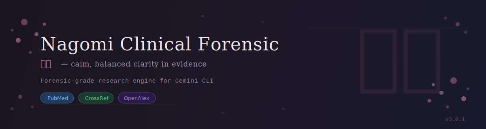

<div align="center">



**Forensic-grade clinical research engine for Gemini CLI**

[](https://gcli.dev)
[](https://pubmed.ncbi.nlm.nih.gov)
[](https://github.com/avivlyweb/pubmed-gemini-extension/releases)
[](#license)

</div>

---

# 🌸 Nagomi (和み): Calm Clarity in a Crisis of Fraud

Nagomi is not just a search tool. It is a **forensic-grade clinical research engine** designed to protect the integrity of medical science. 

In a world where **1 in 500 academic papers are retracted** and AI hallucinations create "fake evidence" that looks 100% real, Nagomi acts as your scientific gatekeeper. It uses mathematical logic and deep-database cross-referencing to separate ground-breaking research from AI-generated fabrications.

---

## 🎬 See It In Action

<div align="center">


</div>

---

## 🚀 Why Nagomi? (The Power of Forensic Research)

### ⚡ 1 Year of Research in 45 Seconds
*   **The Scenario:** A student spent a full year manually researching diagnostic clusters for shoulder impingement.
*   **The Nagomi Result:** In **45 seconds**, Nagomi performed a PICO-optimized search, audited the methodology of 20+ articles, and generated a more accurate, 2025-aligned clinical algorithm.
*   **Impact:** Massive ROI for clinicians and students who need "Gold Standard" answers without the manual labor.

### 🕵️‍♂️ Catching "Uncatchable" AI Hallucinations
Nagomi automates scientific logic checks that standard plagiarism tools miss.
*   **The Case:** Detected a **Sequential ID Mismatch** in a student paper.
*   **The Proof:** Proved a cited "2025 AI Study" was actually using an ID from a **2020 paper about bladder infections**.
*   **Impact:** Absolute protection for academic integrity and degree quality control.

---

## 🛠️ The Clinical Research Suite

| Command | Capability | The Nagomi "Superpower" |
|:--|:--|:--|
| **`/nagomi:search`** | **PICO-Optimized Search** | Doesn't just find keywords. It extracts **Population, Intervention, Comparison, and Outcome** to find the exact clinical "DNA" of your question. |
| **`/nagomi:synthesis`**| **PhD-Level Collation** | Collates dozens of studies into a weighted **Evidence Compass**. It tells you not just *what* was found, but *how much you should trust it*. |
| **`/nagomi:verify`** | **Hallucination Hunter** | Scans PDFs/DOIs for **Volume Paradoxes** and **Stolen IDs**. Catch fabrication before it enters your bibliography. |
| **`/nagomi:analyze`** | **Methodological Audit** | Performs a deep-dive on a single PMID. Grades it **A to D** based on sample size, study design, and risk of bias. |
| **`/nagomi:export`** | **Seamless Integration** | Instant export to **BibTeX or RIS**. Connects your research directly to Zotero, Mendeley, or LaTeX. |

---

## 🧠 The ABC-TOM v3.1 Intelligence Layers

Nagomi doesn't just "search"—it **thinks** like a forensic auditor:

1.  **PICO Translation:** Automatically converts casual questions (e.g., "best gout meds") into precise clinical search strings.
2.  **Evidence Compass:** A visual weighted verdict that correctly favors Grade A Systematic Reviews over anecdotal Case Reports.
3.  **Volume Paradox Logic:** Identifies "Frankenstein" citations where the volume number is mathematically impossible for the cited year.
4.  **Sequential ID Tracking:** Detects when an AI reuses real article IDs from old papers to mask fake new titles.
5.  **Retraction Monitor:** Alerts you if a paper in your list has been officially pulled for fraud since its publication.

---

## Usage Examples

**For Clinicians: Find the "Best" Treatment**
```bash
/nagomi:search what is the most effective treatment for Achilles tendinopathy
/nagomi:synthesis yoga vs meditation for neuroplasticity in seniors
```

**For Professors: Audit Academic Integrity**
```bash
/nagomi:verify ~/Downloads/final_submission.pdf
/nagomi:verify 10.1016/j.mcna.2014.03.005
```

**For Researchers: Deep-Dive and Export**
```bash
/nagomi:analyze 34580864
/nagomi:export "chronic heart failure telemonitoring" format=bibtex
```

---

## Installation

```bash
gemini extensions install https://github.com/avivlyweb/pubmed-gemini-extension
```

**Requirements:** Gemini CLI, Node.js 18+, Python 3.9+

---

## Version History

| Version | Milestone | Features |
|---------|-----------|----------|
| **3.1.0** | **The Forensic Update** | Volume Paradox, Sequential IDs, Renamed to Nagomi. |
| **3.0.0** | **The ABC-TOM Update** | 6-Tier Classification, Grey Literature detection. |
| **2.5.0** | **The Evidence Update** | Evidence Compass, PICO logic, Weighted Verdicts. |

---

## License

MIT

---

> [!IMPORTANT]
> Nagomi Clinical Forensic is a research tool for scholarly exploration. It does not constitute medical advice. Clinical decisions should always be mediated by qualified practitioners.

<div align="center">


<sub>Made with love by Aviv at <a href="https://physiotherapy.ai">avivly</a></sub>

</div>
